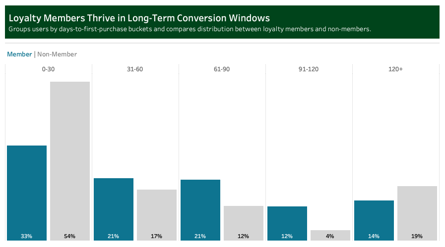

# 
PixelShip E-Commerce Analysis

  

# Overview
PixelShip is a global e-commerce company founded in 2018 that sells popular electronics from brands like Apple, Samsung, and Lenovo via its website and mobile app. Despite possessing a massive—and largely underutilized—dataset of orders, customers, and shipping information, the company's data was messy and had not been leveraged for strategic insights.

To address this, the Head of Operations commissioned a comprehensive sales and operational trend analysis focusing on the volatile 2019-2022 period. The primary goal was to uncover critical, data-driven insights to optimize operations, improve team processes, and understand peak-COVID performance.

This analysis provides actionable recommendations for the sales, marketing, and product teams by focusing on three North Star Metrics: Sales Revenue, Average Order Value (AOV), and Order Count.

# ERD

# Executive Summary
This analysis of PixelShip's e-commerce data from 2019-2022 reveals a company shaped by pandemic-driven volatility, with significant opportunities in loyalty program expansion and product-level optimization.

From 2019 to 2022, the company averaged 27,000 sales per year, generating an average of $7M in annual revenue with an Average Order Value (AOV) of $254. Performance peaked in 2020 with more than double the sales and revenue of 2019. While order volume continued to grow in 2021, AOV and total revenue declined as purchasing behavior normalized post-COVID.  

Key findings include:
- **Loyalty Program Success:** The loyalty program has emerged as a key growth engine. In 2021-2022, loyalty members made more purchases than non-members and, by 2022, spent approximately $30 more on average per order.  
- **Product & Refund Tension:** Refund trends highlight a divide between high-volume and high-value products. While high-volume items like AirPods generate the most returns by count, premium products like the ThinkPad Laptop (11.7% rate) and other laptops (6% rate) have the highest refund rates, signaling a potential gap in customer expectations versus product quality or price.  
- **Top Revenue Driver:** The 27in 4K Gaming Monitor was the top product by revenue, underscoring its strategic importance.  

Key opportunities lie in expanding the loyalty program to maximize retention, addressing the high refund risk for premium products through improved support, and leveraging seasonal trends to optimize inventory.

# Detailed Analysis & Insights
## Sales Performance

The volatile years between 2019 and 2022 underscore the impact of pandemic-driven behavior and the need for agile forecasting. North America remains the dominant market, contributing over half of total sales. The 27in 4K Gaming Monitor emerged as the top revenue driver, with seasonal spikes tied to remote work and holiday demand. High-AOV products, like the ThinkPad Laptop and Macbook Air Laptop, played a strategic role in revenue growth despite lower order volume, reinforcing the value of premium offerings in the sales mix.

  

- North America consistently led in sales contribution, accounting for 52% of total revenue across a volatile four-year period. The pandemic triggered a dramatic +163% YoY surge in 2020, followed by a -46% correction in 2022 as demand normalized.
  
- This volatility underscores the importance of agile forecasting and regional segmentation. North America’s resilience suggests it should remain a strategic anchor while other regions are evaluated for growth potential.

  

- The 27in 4K Gaming Monitor emerged as the top revenue driver, with strong performance across multiple regions. Apple AirPods led in order count but ranked second in revenue, reflecting their mass-market appeal. The MacBook Air, despite having 10x fewer orders than AirPods, contributed significantly to revenue due to its high AOV.
  
- This mix of volume and premium pricing highlights the importance of balancing accessibility with strategic high-value offerings.

  

- Sales of the 27in 4K Gaming Monitor peaked during Q4 2020, aligning with remote work and holiday shopping trends. The highest concentration of purchases occurred in the weeks leading up to Thanksgiving and Christmas. 

- This seasonal surge reflects consumer investment in home entertainment and productivity during post-COVID restrictions. It also reinforces the value of time-sensitive promotions and inventory planning around key calendar windows.

## Product Dynamics

Refund patterns reveal key product dynamics across volume, value, and customer expectations. While high-selling items naturally generate more refunds, elevated refund rates on premium products suggest potential gaps in perceived quality or buyer confidence. These trends highlight opportunities to refine product positioning, enhance post-purchase support, and align customer expectations, especially for high-AOV products.

  

- High-AOV products like the MacBook Air and ThinkPad Laptop show elevated refund rates, introducing tension between perceived value and customer satisfaction. The ThinkPad leads with an 11.7% refund rate, while the MacBook Air follows closely at 11.4%, despite generating $3.1M more in sales. 

- These patterns suggest that premium pricing may raise expectations that aren't always met. Addressing post-purchase experience and product positioning could reduce refund risk in high-value segments.

  

- Apple AirPods have the highest number of refunds (2.6K) but maintain a relatively low refund rate of 5.4%, likely due to their massive sales volume. In contrast, the MacBook Air has fewer refunds but a much higher refund rate, pointing to quality perception or buyer hesitation. 

- This distinction helps separate operational volume from customer satisfaction concerns. It also suggests that refund mitigation strategies should be tailored by product tier.

  

- Refund rates for high-AOV products like the MacBook Air and ThinkPad Laptop remained elevated until a sharp drop to 0% in 2022. This decline may reflect operational improvements, policy changes, or shifts in customer expectations. 

- Tracking refund trends over time helps isolate whether issues are product-specific or systemic. It also provides a feedback loop for refining product quality and support strategies.

## Loyalty Program Impact

Loyalty program performance signals sustained value creation rather than accelerated acquisition. Since mid-2021, loyalty members have consistently outperformed non-loyalty users in both AOV and order volume, despite similar conversion speeds. The stronger mid-term engagement suggests the program is effectively driving retention and deeper customer investment. These trends highlight opportunities to optimize lifecycle marketing and reinforce loyalty incentives that compound over time.

  

- Loyalty members overtook non-members in AOV in mid-2021 and sustained a $30 lead through late 2022. This consistent gap suggests that loyalty participants are more willing to invest per purchase.
  
- The trend reflects deeper customer commitment and possibly stronger alignment with premium offerings. It also validates the loyalty program’s role in driving long-term value rather than short-term acquisition.

  

- From December 2020 to August 2022, loyalty members consistently placed more orders than non-members. This behavior indicates stronger engagement and repeat purchasing, not just higher spend per order. 

- The volume advantage complements the AOV lead, reinforcing the program’s impact on both frequency and value. Together, these metrics suggest loyalty members are more profitable and more predictable.

  

- Loyalty members convert more reliably in mid-range windows (31–120 days), outperforming non-members in every bucket beyond the first 30 days. This pattern suggests thoughtful, committed purchasing rather than impulsive behavior. 

- It also highlights the loyalty program’s strength in nurturing long-term engagement rather than accelerating immediate conversion. Lifecycle marketing strategies should focus on reinforcing value during this mid-funnel window.

## Marketing Segment Behavior

The marketing segment behavior analysis reveals how acquisition source, device type, and platform shape customer value and risk profiles. Website purchases—especially from social media and unknown channels—tend to carry higher refund rates, suggesting lower buyer confidence or friction in the browsing experience. In contrast, mobile app users show stronger loyalty engagement and lower refund risk, indicating deeper intent and better post-purchase satisfaction. Spending behavior varies by channel, with some driving consistent mid-tier value while others attract volatile or high-AOV outliers. Together, these patterns highlight the need for tailored lifecycle strategies that align acquisition tactics with platform strengths and customer expectations.

  

- Refund risk is highest among website purchases from social media and unknown channels, especially when paired with tablet or TV devices. These segments show elevated refund rates, suggesting passive browsing, low buyer confidence, or attribution gaps. 

- In contrast, mobile app purchases—particularly via direct and email channels—show lower refund rates, indicating stronger intent and post-purchase satisfaction. Segmenting by device and channel reveals clear behavioral differences worth targeting.

  

- Spending behavior varies widely across acquisition sources. Direct and email channels show consistent mid-tier AOV, while affiliate and social media channels display greater volatility and outliers. 

- This suggests that some channels attract more predictable buyers, while others bring in mixed-intent traffic. Overlaying refund risk reveals that high spend doesn’t always mean high satisfaction, reinforcing the need for value alignment.

  

- Mobile app purchases from affiliate, social media, and email channels drive the highest loyalty engagement, with rates above 60–75%. Website purchases—especially via affiliate and direct channels—lag behind, suggesting weaker retention.
  
- This highlights mobile-first environments as key drivers of long-term customer investment. Pairing acquisition strategy with platform behavior can optimize loyalty outcomes.

# Actionable Recommendations for Stakeholders

**For the Executive Leadership:**
- Double down on North America as the primary revenue engine, but monitor for post-pandemic normalization and diversify regional bets.
- Elevate high-AOV products like the MacBook Air in strategic planning — they drive disproportionate revenue despite lower volume.
- Invest in loyalty program expansion, especially through mobile app channels, to deepen mid-term engagement and customer lifetime value.
- Reassess refund policies for premium products — high return rates may signal misaligned expectations or quality perception gaps.

**For the Marketing and Acquisition Teams:**
- Prioritize mobile app acquisition via affiliate, social media, and email — these segments show the highest loyalty conversion and lowest refund risk.
- Audit social media and unknown website traffic, especially on tablets and TVs — these segments show elevated refund rates and may require better targeting or messaging.
- Refine messaging for high-AOV products in volatile channels (e.g., affiliate, social) to align perceived value with actual product experience.
- Use channel-platform pairing to guide campaign design — not all traffic converts or retains equally.

**For the Product and Merchandising Teams:**
- Monitor refund rates on premium SKUs (e.g., ThinkPad, MacBook) — consider post-purchase education, setup support, or satisfaction guarantees.
- Leverage seasonal demand patterns (e.g., Q4 spikes for gaming monitors) to optimize inventory and promotional timing.
- Bundle or reposition high-AOV items with lower-risk accessories to reduce perceived purchase friction.
- Use refund trends by year to evaluate the impact of policy or quality changes — the 2022 drop to 0% suggests operational levers are working.

**For the Digital and UX Teams:**
- Optimize mobile app UX — it’s the strongest loyalty driver and lowest refund environment.
- Improve website experience for tablet and TV users, especially from social channels — these segments show high refund risk and may suffer from poor navigation or unclear expectations.
- Enhance mid-funnel engagement flows (31–120 days) for loyalty members — this is where they outperform in conversion reliability.
- Add contextual tooltips and nudges during checkout for high-AOV products to reinforce value and reduce buyer hesitation.

### Tools & Technical Documentation
**Tools Used:** Excel, Google BigQuery, and Tableau.
