# 
PixelShip E-Commerce Analysis

  

# Overview
PixelShip is a global e-commerce company founded in 2018, specializing in consumer electronics from leading brands such as Apple, Samsung, and Lenovo. With operations spanning multiple regions and platforms, the company has accumulated a rich but underutilized dataset capturing customer behavior, product performance, and sales dynamics over time. In response to shifting market conditions and evolving customer expectations, the Head of Operations commissioned a comprehensive analysis of sales trends from 2019 to 2022.

This project aims to uncover actionable insights that will inform strategic decisions across finance, sales, and product teams. By examining the impact of pandemic-driven demand, regional performance, product mix, refund behavior, and loyalty engagement, the analysis will equip stakeholders with a clear understanding of what drove growth, where risks emerged, and how to capitalize on high-value segments. The findings will be presented at the upcoming company-wide town hall to align teams around key opportunities and guide future planning.

# ERD
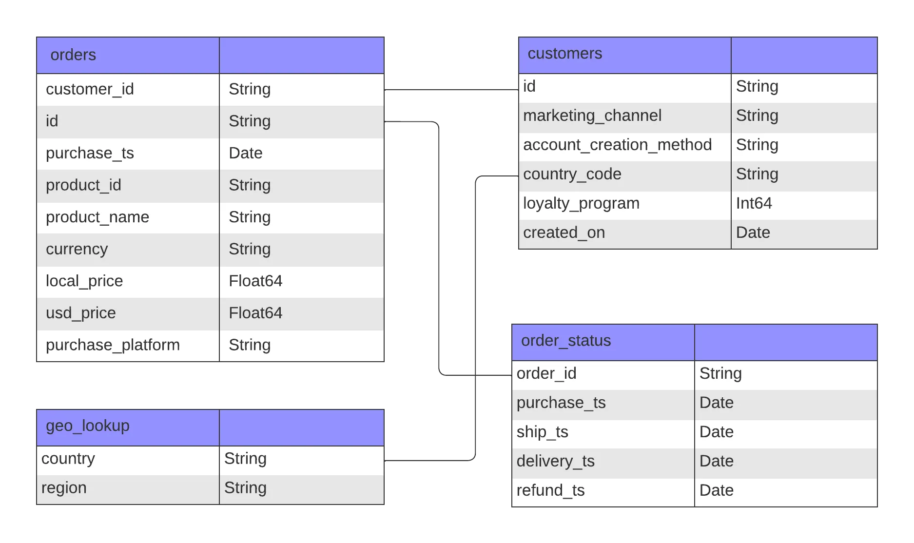

# Executive Summary
PixelShip’s sales performance between 2019 and 2022 reflects a volatile market shaped by pandemic-driven demand and post-COVID normalization. A dramatic surge in 2020 was followed by a correction in 2022, yet the company’s loyalty program emerged as a consistent growth engine. Loyalty members outperformed non-members in both average order value (AOV) and order volume, signaling deeper engagement and long-term customer value. Meanwhile, refund trends reveal tension between product price and satisfaction: premium items like the MacBook and ThinkPad show elevated refund rates, while high-volume products like AirPods generate the most returns by count.

Key opportunities lie in:
- Expanding and refining the loyalty program to maximize retention and mid-funnel conversion.
- Addressing refund risk through improved post-purchase support and expectation alignment for high-AOV products.
- Leveraging seasonal and regional insights to optimize inventory, promotions, and product positioning.

# Detailed Analysis & Insights
## Sales Performance

The volatile years between 2019 and 2022 underscore the impact of pandemic-driven behavior and the need for agile forecasting. North America remains the dominant market, contributing over half of total sales. The 27in 4K Gaming Monitor emerged as the top revenue driver, with seasonal spikes tied to remote work and holiday demand. High-AOV products, like the ThinkPad Laptop and Macbook Air Laptop, played a strategic role in revenue growth despite lower order volume, reinforcing the value of premium offerings in the sales mix.

  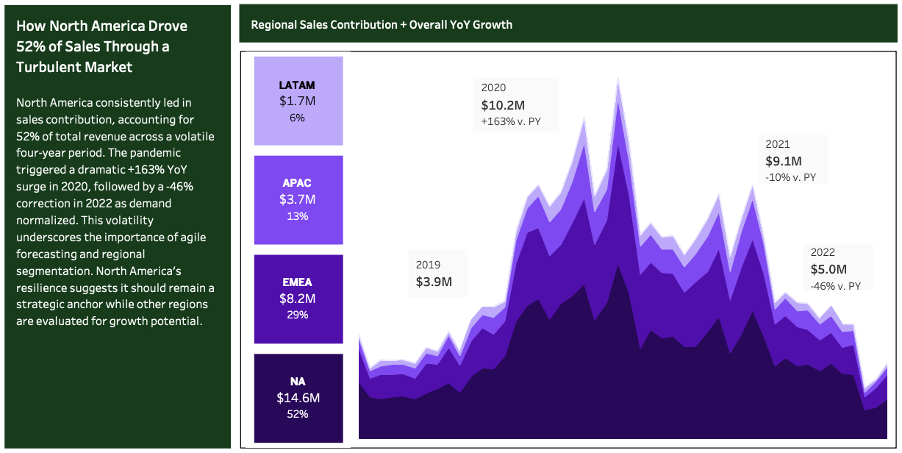

  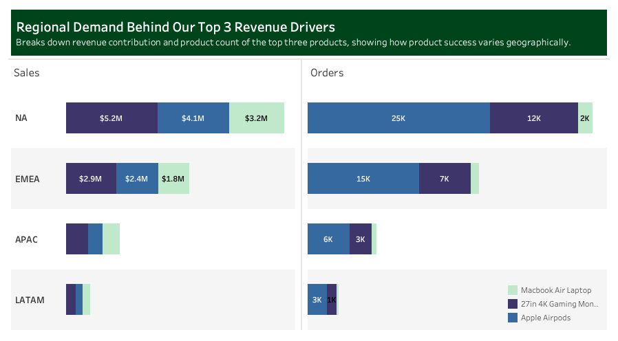

  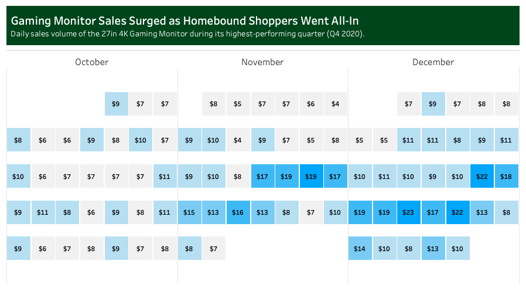

## Product Dynamics

Refund patterns reveal key product dynamics across volume, value, and customer expectations. While high-selling items naturally generate more refunds, elevated refund rates on premium products suggest potential gaps in perceived quality or buyer confidence. These trends highlight opportunities to refine product positioning, enhance post-purchase support, and align customer expectations, especially for high-AOV products.

  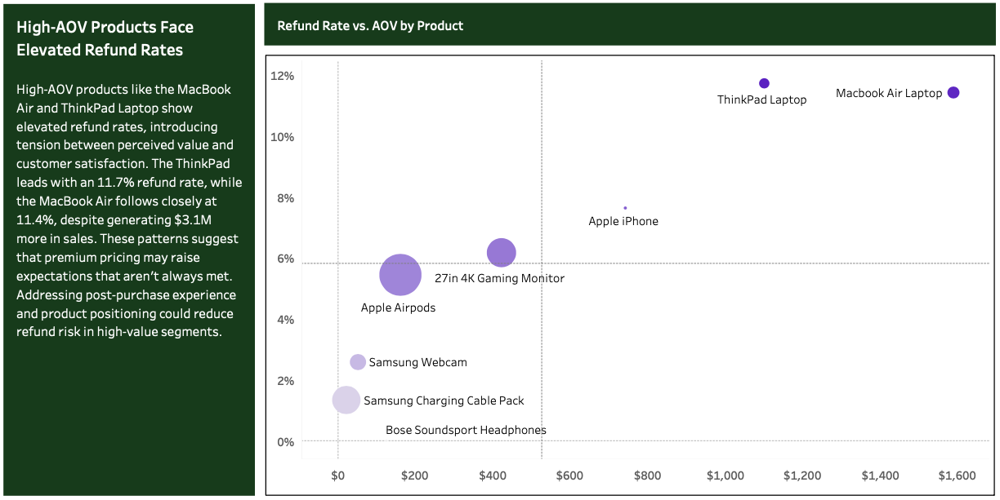

  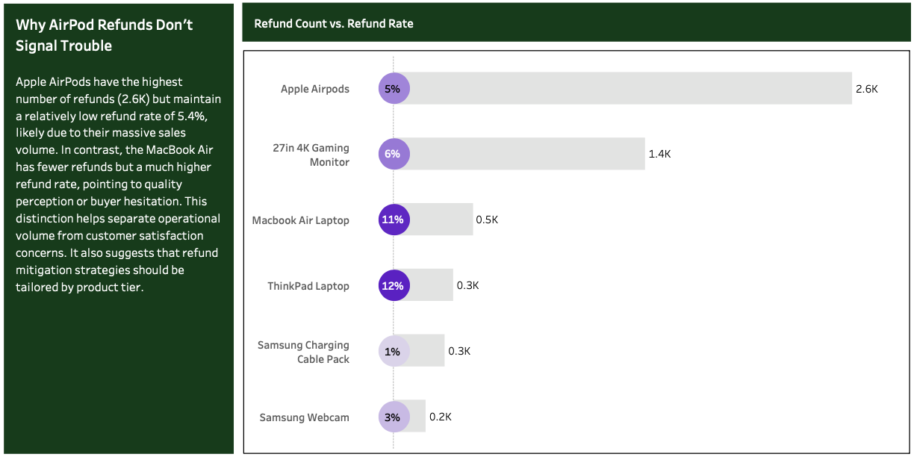

  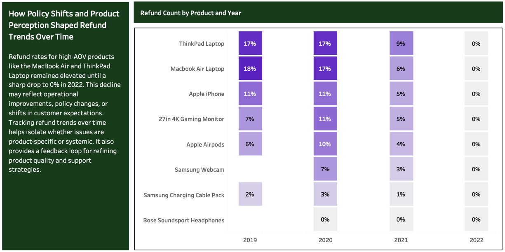

## Loyalty Program Impact

Loyalty program performance signals sustained value creation rather than accelerated acquisition. Since mid-2021, loyalty members have consistently outperformed non-loyalty users in both AOV and order volume, despite similar conversion speeds. The stronger mid-term engagement suggests the program is effectively driving retention and deeper customer investment. These trends highlight opportunities to optimize lifecycle marketing and reinforce loyalty incentives that compound over time.

  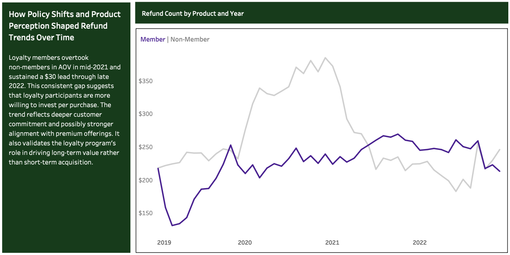

  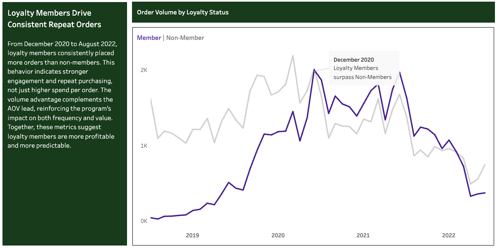

## Marketing Segment Behavior

The marketing segment behavior analysis reveals how acquisition source, device type, and platform shape customer value and risk profiles. Website purchases—especially from social media and unknown channels—tend to carry higher refund rates, suggesting lower buyer confidence or friction in the browsing experience. In contrast, mobile app users show stronger loyalty engagement and lower refund risk, indicating deeper intent and better post-purchase satisfaction. Spending behavior varies by channel, with some driving consistent mid-tier value while others attract volatile or high-AOV outliers. Together, these patterns highlight the need for tailored lifecycle strategies that align acquisition tactics with platform strengths and customer expectations.

  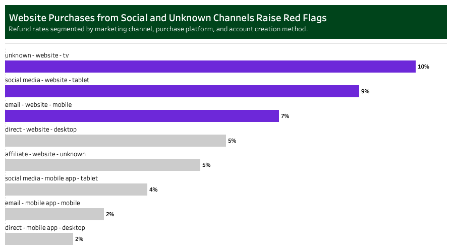

  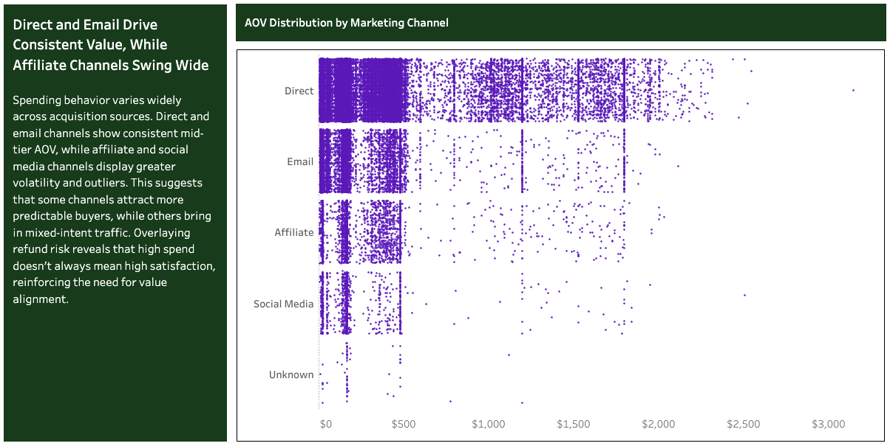

  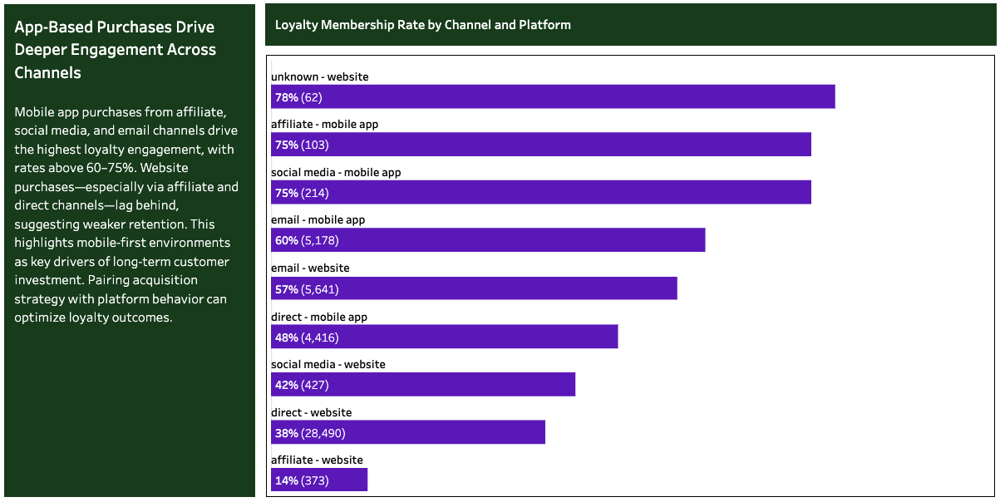

# Actionable Recommendations for Stakeholders

**For the Executive Leadership:**
- Double down on North America as the primary revenue engine, but monitor for post-pandemic normalization and diversify regional bets.
- Elevate high-AOV products like the MacBook Air in strategic planning — they drive disproportionate revenue despite lower volume.
- Invest in loyalty program expansion, especially through mobile app channels, to deepen mid-term engagement and customer lifetime value.
- Reassess refund policies for premium products — high return rates may signal misaligned expectations or quality perception gaps.

**For the Marketing and Acquisition Teams:**
- Prioritize mobile app acquisition via affiliate, social media, and email — these segments show the highest loyalty conversion and lowest refund risk.
- Audit social media and unknown website traffic, especially on tablets and TVs — these segments show elevated refund rates and may require better targeting or messaging.
- Refine messaging for high-AOV products in volatile channels (e.g., affiliate, social) to align perceived value with actual product experience.
- Use channel-platform pairing to guide campaign design — not all traffic converts or retains equally.

**For the Product and Merchandising Teams:**
- Monitor refund rates on premium SKUs (e.g., ThinkPad, MacBook) — consider post-purchase education, setup support, or satisfaction guarantees.
- Leverage seasonal demand patterns (e.g., Q4 spikes for gaming monitors) to optimize inventory and promotional timing.
- Bundle or reposition high-AOV items with lower-risk accessories to reduce perceived purchase friction.
- Use refund trends by year to evaluate the impact of policy or quality changes — the 2022 drop to 0% suggests operational levers are working.

**For the Product and Merchandising Teams:**
- Optimize mobile app UX — it’s the strongest loyalty driver and lowest refund environment.
- Improve website experience for tablet and TV users, especially from social channels — these segments show high refund risk and may suffer from poor navigation or unclear expectations.
- Enhance mid-funnel engagement flows (31–120 days) for loyalty members — this is where they outperform in conversion reliability.
- Add contextual tooltips and nudges during checkout for high-AOV products to reinforce value and reduce buyer hesitation.

### Tools & Technical Documentation
**Tools Used:** Excel, Google BigQuery, and Tableau.
